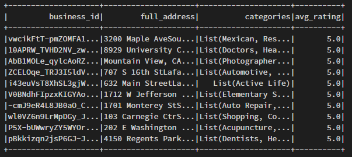
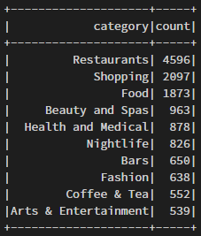

# YelpDataset
This program uses Apache Spark (using Databricks to run) to derive some statistics from the Yelp Dataset. Files have been slightly modified to better serve the purpose of the project.

## Files Used
The files to be parsed are found in the data folder, notably business.csv and review.csv

## Purpose
1. The program lists the business ID and separate categories of the Top 10 businesses, based on their average ratings.

2. The program then finds the Top 10 categories that have the most business count.

